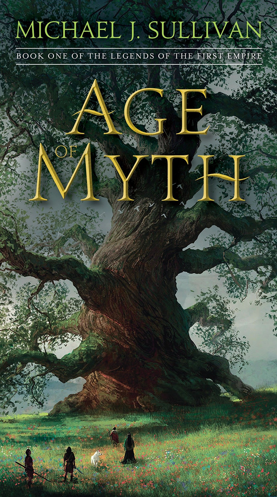

# Age of Myth

## Reading Dates
| Start | Finish | Medium |
| ---------- | ---------- | ----- |
| 02/18/2021 | 02/22/2021 | Audio |

---

## Rating and Review *****
I loved this book. I had just finished reading the Inheritance Cycle when I started reading it and was a little worried I would feel disoriented and that I wouldn't get invested in the story, but I did. I liked the characters so much and found that I really cared what happened to them.

This story was an interesting take on a pretty typical fantasy world and I really enjoyed it.

---

## Content Y.L2.S2.V3
This was a great book that I would definitely recommend. There isn't much to be concerned about as far as content goes.

### Recommendability: Yes
This book is great. I highly recommend it. I don't really know what else to say.

### Language: 2
This book might swear like one time, but if it did, it wasn't a very "severe" swear word. I'm just putting it at 2 to be safe.

### Sex: 2
There were a few references to sex, a couple mentions of adultery, and maybe a little inuendo. At no point in the plot do any characters have sex (on screen) and there are no descriptions of the act of sex.

### Violence: 3
This book did have some violence with a moderate level of blood and gore. There are fight scenes with swords and spears with typical sword and spear injuries and there is one mauling.

---
## Spoiler Summary
* Raithe kills a "god" (pretty much an elf)
* The elf people (fhrey) kill all his people in retribution (behind the scenes)
* A young "mystic" tells the late chief's wife (Persephone) that disaster is coming to the village
    * A bear recently killed the chief
* The young mystic (Suri) has a pet wolf
* Suri and Persephone go talk to an old tree about the fate of the village
    * The tree tells them to "welcome the gods," "heal the injured," and "follow the wolf"
    * They meet Raithe and Malcom(?) on their way. Raithe and Malcom kill some village bois
* There's a bad bear
* The bear might be some lady's daughter
* Suri does a augery and reads chicken bones
    * The bones say Grin is gonna kill everyone
    * Grin is the big bad bear (that may be some lady's daughter)
* Some renegade Fhrey show up. Everyone's scared but they didn't want to kill anyone
* Another Fhrey shows up to take names and kick buts (with magic) but gets hit on the head
* Suri goes to take out the bear with the bear's "mother"
    * Turns out Suri was the bear all along (she was the girl everyone thought became a bear)
    * The bear kills Suri's mother
* The new chief tries to kill Persephone
    * The bear (that Suri set on fire with magic) comes down to the river and mauls the chief before Persephone kills it when its head gets stuck in a magical door
* A mean Fhrey comes to kick names and take butts (his name is Gryndal, turns out the augury was about him)
* He's going to kill the (now nice) fhrey witch but Suri steps in and stops him
* In the end, Raithe kills the mean boi
    * He's godkiller twice over