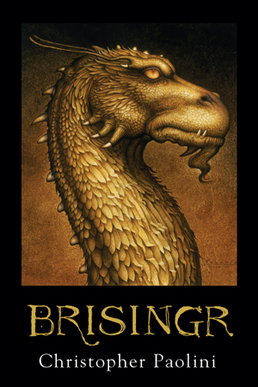

# Brisingr

## Reading Dates
| Start | Finish | Medium |
| ---------- | ---------- | ----- |
| 02/03/2021 | 02/12/2021 | Audio |

---

## Rating and Review ****
I thoroughly enjoyed reading Brisingr. I read it for the first time as a teenager as the series came out and it still holds a special place in my heart. Even now, years later, I love the characters and the world they're placed in.

It is really interesting to watch Eragon progress over the course of this story. I really feel like Christopher Paolini lets the reader grow with Eragon. His thoughts, feelings, and abilities are all understandable and feel like natural responses to the situations he's dealt with up to this point.

Another interesting thing about this book (and the other books in the Inheritence Cycle) is that the books feel episoic to me. I tend to think of this series in terms of the series as a whole as opposed to as individual books. This isn't a criticim, just an interesting thought. These aspects of the story don't bother me.

Also, I love Angela. I wouldn't mind seeing more of her.

---

## Content Y.L2.S2.V3
Overall, this book is very accessible. I believe it is appropriate for a teenage audience.

### Recommendability: Yes
This is a fun, well-written book. I enjoyed reading it, and the content isn't bad enough that I would ever hesitate to recommend it to a peer.

### Language: 2
As far as I recall, the book doesn't have any swear words. It has stand-in words from some of the characters' languages and at other times it will say "he swore." That's as bad as it gets.

### Sex: 2
There is no sex portrayed in the book, but characters do make a few references to sex and pregnancy over the course of the book.

### Violence: 3
There are large wars and small skirmishes in this book. Some injuries are described in graphic detail. These occurences aren't too frequent or graphic to be significantly disturbing.

---

## Spoiler Summary
* Eragon and Roran save Katrina from the Ra'zac
* Eragon stays behind to save/curse Sloan
* Arya meets him to run back to the Varden together
    * Arya weaves magical grass ship
    * Spirits visit them and turn Eragon's flower (for Arya) to living metal.
* Eragon and Saphira fight off Murtagh and Thorne with the help of elves.
* Eragon Attempts to heal Elva
* Eragon goes to support Orik at the Dwarf coronation
    * He is almost assassinated
* Saphira Heals the star sapphire
* Eragon and Saphira go to Du Weldenvarden
    * They learn about the Eldunari
    * Eragon gets a rider's Sword
    * They receive Glaidr's Eldunari
* Eragon flies to help the seige of Feinster
    * Arya kills a shade
    * Glaidr and Orimis die

