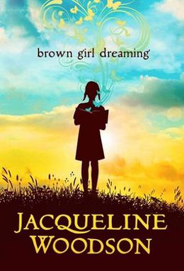

# Brown Girl Dreaming

## Reading Dates
| Start | Finish |
| ---------- | ---------- |
| 12/25/2021 | 01/12/2021 |

---

## Rating and Review *****
Brown Girl Dreaming is a beautiful story written in verse. The book contained many beautiful poems that related the author's autobiographical story so well. From what I understand, the author just wanted to share her perspective and I feel like she did that very well.

My greatest takeaway from this book was the desire to create. The author conveyed her own thoughts and feelings about writing poetry so eloquently that it made me want to do the same.

---
## Content Y.L1.S1.V1
This is just a book of poetry that relates the experiences of the author growing up as a Black girl in the south and in New York.

### Recommendability: Yes
Some of the poems in this book touched me very deeply and really made me think about my own life and what I'm doing to create.

### Language: 1
I don't think there were any swear words in this book (I could be wrong about that).
    

### Sex: 1
No sexual content in this book. It focuses on the perspectives and feelings of a young Black girl as she grows up and develops a love for writing.
    
### Violence: 1
There was no violence depicted in this book.
    
---
## Spoiler Summary
* It's just a beautiful book. You should read it.
* Her mother separates from her father and takes her and her siblings to live with their grandparents in the South.
* There are a couple poems that share her experiences dealing with racism.
* A lot of the book handles her discovery of writing and poetry.
* Eventually, her family moves to New York.