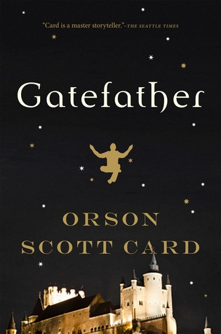

# Gatefather
By: Orson Scott Card

## Reading Dates
| Start | Finish | Medium |
| ---------- | ---------- | ----- |
| 03/15/2021 | 03/16/2021 | Audio |

---

## Rating and Review **
This series had a lot of interesting concepts and involved lots of interesting ideas, but I feel like all those good things were stitched together sloppily. I didn't feel like the book was building up to anything and the resolution ended up just feeling like another point in the meandering plot instead of a satisfying payoff.

Orson Scott Card is clearly a gifted writer, I just don't think he had/took the time necessary to fully realize the potential of this series.

---

## Content N.L3.S3.V2
The book was meh. The content was mild enough that any adult could read it.

### Recommendability: No
I just didn't enjoy this book. I listened to it over a really short period of time (less than 24 hours), but not because I was sucked in and couldn't let go--I just had nothing better to do than listen to it while I went around my regular activities. 

### Language: 3
There is some swearing. The "F" word is never used, just other "less egregious" words on occasion. 

### Sex: 3
There are references to sex and there was a mild sex scene in the previous book (which this book refers to a few times), but nothing is described in graphic detail.

### Violence: 2
There is one brutal death in the previous book that is referred to a couple times, but there isn't much blood or gore in this book.