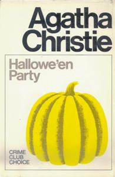

# Hallowe'en Party

## Reading Dates
| Start | Finish | Medium |
| ---------- | ---------- | ------ |
| 01/08/2021 | 01/11/2021 | Audio |

---

## Rating and Review *****
Agatha Christie is amazing. This is another great murder mystery. Truth is, I was listening to the audiobook and it wasn't even a regular audiobook, it was like a theatrical version that was literally only dialogue from different voice actors, so I wasn't paying super good attention. I should probably read it again tbh.

---
## Content Y.L1.S1.V3
The only potential concern anyone could have with this book is that it is a murder mystery. If that's not you're cup of tea, you probably shouldn't be reading Agatha Christie.   

### Recommendability: Yes
It's a great book. Unique story. Enjoyable read.    

### Language: 1
I don't think any of Agatha's books have any language. I might be wrong about that. I'll have to pay more attention in the future.

### Sex: 1
If I recall correctly, I don't think there was a single reference to sex. I don't believe there was any romantic interaction at all.

### Violence: 3
It's a murder mystery. There are no fights or active violence portrayed, but the whole story centers on the murder of a child, which could potentially be disturbing.

---
## Spoiler Summary
* A Hercule Poirot mystery.
* A young girl is drowned bobbing for apples at a Halloween party.
* Earlier in the party she was overhear talking about witnessing a murder.
* There was a recent murder that Hercule Poirot investigates to see if they were related.
* Turns out, another young girl witnessed the murder and talked about it. The murdered girl was only parroting the story she was told.
* The witness young girl is the daughter of a gardener man. 
* That gardener man was the murderer.
    * He wanted to steal a fortune to be able to build his dream garden
    * He murdered all the people who were aware of the plot to cover up his tracks. He was even willing to kill his own daughter (who witnessed the disposal of one of the bodies).
    * Good thing Hercule Poirot saved her.