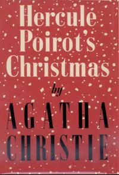

# Hercule Poirot's Christmas

## Reading Dates
| Start | Finish | Medium | 
| ---------- | ---------- | ------ |
| 12/20/2020 | 01/25/2021 | Kindle |

---

## Rating and Review ****
This was another great Agatha Christie. There really isn't anyone else who can compete with her when it comes to murder mysteries. Every single one of her stories I've read has been original. She manages to perfectly walk the line between not revealing enough that you can easily solve the mystery on your own and giving enough details that, when all is revealed, you wonder how you could have missed it.

This book was no exception as far as Agatha Christie's prowess goes. Another great Hercule Poirot mystery. I don't really know what else to say about it. I feel like I could pretty much write a single review for all of Agatha's books because the quality is so consistent.

---

## Content Y.L1.S1.V2
Great book. I definitely recommend it. There isn't really anything to be worried about content-wise except for the fact that there is a murder. Probably not a great story for kids.

### Recommendability: Yes
I feel like I've already said it a bunch in this review already, but I totally recommend this book. I haven't read a book by Agatha Christie that I wouldn't recommend yet.

### Language: 1
This book doesn't have any casual swearing or even substitute swear words.

### Sex: 1
The book refers to extra-marital relationships a few times, but there are no direct allusions to sex that occurs during the course of the novel.

### Violence: 2

This is a murder mystery, so there is a dead person and discriptions of blood and the scene left by violence. All told, it doesn't amount to much gore, but it might dissuade some very squeamish readers.
    
---
## Spoiler Summary
* Super bad dad brings all of his family in for Christmas
* Super bad dad has had a handful kids out of wedlock
* Pretty much all of his children have some reason to want to kill him
* They think his Spanish neice (who turns out not to be his neice) did it
* He was found dead in his study with the door locked
* Turns out it was one of the cops who came to the scene. He was one of his invalid children and he wanted to get revenge for some reason
* Oh, and some uncut diamonds were stolen
* There was a pig skin screaming device involved in how it all played out.