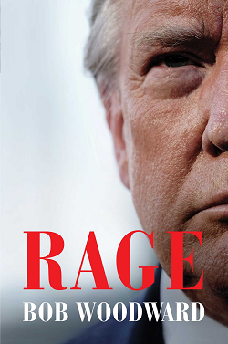

# Rage

## Reading Dates
| Start | Finish | Medium |
| ---------- | ---------- | ------ |
| 01/13/2021 | 01/21/2021 | Audio |

---

## Rating and Review *****
This is the fourth book I read in an attempt to understand more about Donald Trump and his presidency. Of the four ([Understanding Trump](UnderstandingTrump.md), [Let Trump Be Trump](LetTrumpBeTrump.md), and [Too Much and Never Enough](TooMuchAndNeverEnough.md)), this one was my favorite. I felt like it was the most impartial, honest portrayal of the man and his presidency. All the others felt much more biased and agenda-focused to me.

I feel like Bob Woodword does a good job in this book of representing Trump. The book doesn't represent him well, so maybe my willingness to accept this book as truth reflects more on my biases than reality, but I try my best to be impartial. I read two pro-Trump books and one other anti-Trump book. Both pro-Trump books were just rants against the Democratic party and Liberal ideals. The other anti-Trump book read more like an attention grab. None of them presented as much evidence as impartially as this book did. Even though it reflected poorly on the ex-President, this book didn't read like an anti-Trump book as much as an informative portrayal of facts and quotes. YMMV.

---

## Content Y.L3.S1.V2
Overall this book doesn't have much content that people might want to avoid. I believe it may have occassional "F-words," but only as quotes.

### Recommendability: Yes
I feel like this book as informative and fair as possible. I'm sure anyone who supports Trump will disregard it as easily as I've disregarded the pro-Trump books I've read, but I feel like if any book has the potential to convince anyone to see Trump differently, it's this one.    

### Language: 3
I believe this book may have occassional "F-words," but only as quotes.

### Sex: 1
I know that Trump has made sexual comments in the past, but I don't think anything of that matter is contained within this book. At the very most, any references to sex are just that, indirect, non-specific references.    

### Violence: 2
The book talks about war and the potential of nuclear warfare, but not in any graphic detail.
    
---
## Spoiler Summary
* Lots of Trump's advisors left
* Trump told Bob to write a good book a bunch of times
* Trump had a good relationship with Kim Jung Un