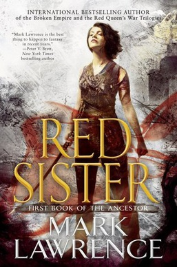

# Red Sister

## Reading Dates
| Start | Finish | Medium |
| ---------- | ---------- | ----- |
| 01/02/2021 | 01/09/2021 | Audio |

---
## Rating and Review ***
This book is very unique. It presents a very unique setting for its characters. The world building was fascinating--I loved reading about the state of the world and contemplating how it might have ended up that way. The magic system was also very orginal (as far as I'm aware).

The characters felt a little flat to me and I wasn't very invested in any of them (except for Nona) or their relationships.

Additionally, I was more committed to the world and the concepts than the actual plot of the story. In my opinion, the plot jumped around quite a bit and I wansn't as invested in the resolution of the major conflict as I should have been.

---
## Content M.L4.S3.V4
Disclaimer: It's been over a month since I read the book and while I remember the major plot details, smaller things like whether or not there was language or whether or not there was any sexual dialogue have begun to slip through my mind.

I will Need to read the book again before giving too much weight to the ratings.

### Recommendability: Maybe
I enjoyed this book, but I can definitely understand that it wouldn't be for everyone. There is a lot of violence and it's set in a rather dark world. 

### Language: 4
I can't remember super well what the language was like in this book. If I had to guess, I would say it contained casual and frequent use of at least moderate swear words and potentially some regular use of the "F word" as well.

### Sex: 3
If there was sexual content in this book, I'm fairly certain it was just references to sex as a concept, not descriptions of the act itself.

### Violence: 4
This is a story about warrior nuns; there is a lot of violence.
---
## Spoiler Summary
* Nona Grey is going to be hung with one of her friends for her role in the murder of a noble.
* Nona's friend is hung.
* Nona is rescued by the abbess of an Abbey where they train young women to be warrior nuns.
* The man Nona killed is super powerful and not dead?
* Nona is put on trial for "killing" that bad dude.
    * She successfully completes the "Trial of the Shield" (or whatever it's called) as fulfillment of some prophecy, thereby proving that she's very fast.
    * Shortly thereafter, the abbess tells her the prophecy isn't real. But she may be lying?
* Nona tries to run the blade path but she always falls off.
* She has a rivalry with a pretty, rich girl (who is the chosen one according to the "prophecy" that may or may not be false). They end up becoming friends.
* Some snotty super powerful four-blood girl swoops in with her evil, super warrior guardian.
* The evil, super warrior guardian is snooping around, planning on stealing the magical rock that helps magical girls with their magical powers.
* Nona does some fights with people at the brawl club she used to live at before she killed that guy
    * Oh yeah, by the way, when the magic boys were holding his soul close waiting for his body to heal, bad demon guys swooped into his body, so now he's double evil.
    * Nona jumps on evil man's face and tries to cut his neck with her magic claws.
        * She does it so fast no one notices
* In the end, she goes on a fun adventure trip, but evil man is there with his cronies, also, her best friend sold her out so the evil man is going to kill her. 
    * Nona freaking goes off and kills everyone.
* The end.
