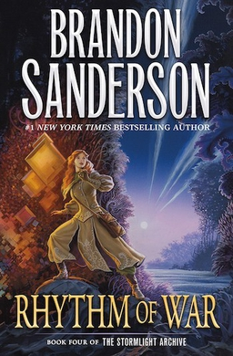

# Rhythm of War

## Reading Dates
| Start      | Finish     | Medium |
| ---------- | ---------- | ------ |
| 11/16/2020 | 12/26/2021 | Kindle |

---

## Rating and Review *****
I loved this book. Of the first four books in the Stormlight Archive, I'm pretty sure it's my second favorite (I'm not sure anything will ever top Way of Kings for me). This book has amazing character work. I was worried what would happen with the Stormlight Archive as the scale of the major conflict escalated; my main concern was that we would lose the intimate exposure we've had to characters so far in favor of chugging through the plot. This book successfully delivered a very cohesive story jam-packed with both world- and character-building.

Kaladin's arc in this book is \*mwah\* perfection.  
Navani's arc is amazing as well.

This book made me cry more than anything else I have ever read. In short, Brandon Sanderson delivers again.

---

## Content Y.L3.S3.V4
The only part of this book that puts it into "danger" territory in my mind is the violence. It uses substitute swear words in place of the worst curses and it never depicts sex (only casually alluding to the fact that some characters have sex).
    

### Recommendability: Yes
I don't think I ever won't recommend Brandon Sanderson. I've loved every single one of his books that I've read and this wasn't an exception. The only content in this book that would make me hesitate to recommend the book is the violence which is more frequent and graphic then I would prefer.
    

### Language: 3
Language isn't something I think of when it comes to Brandon Sanderson. In almost all of his stories so far, he's developed his own substitute swear words that stand in for the worst curses in our language. That being said, I'm pretty sure this book has semi-regular use of the "D" word in the form d***nation (Which--frankly--isn't a huge deal) and maybe infrequent occurences of the "H" word as well.

There are no major swear words (F, A, or S) in the story.

### Sex: 3
There is no explicit sexual content in the book. If my memory serves, there may be a couple "morning after" scenes. While the book doesn't flaunt or depict sex, it makes it clear that it is going on between charaters behind the scenes.

### Violence: 4
This book is violent. It has a handful of very graphic fight scenes with all kinds of stab, slash, cut, and break wounds spread throughout the entirety of the book. There were times I definitely thought that the fight scenes could have used less detail. I read this book out loud to my wife and I had to censor those scenes for her because they were so descriptive.

---
## Spoiler Summary

        