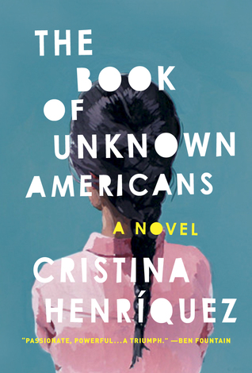

# The Book of Unknown Americans
By: Christina Henriquez

## Reading Dates
| Start | Finish | Medium |
| ---------- | ---------- | ----- |
| 03/07/2021 | 03/08/2021 | Audio |

---

## Rating and Review ***
I didn't enjoy this book. I felt like it was well-written and it pulled my emotions in effective ways, but when I finished listening to it, I can't say that I was glad I did. 

I came to this book hoping for an account/accounts of immigrants to the United States and the challenges they face. The book definitely delivered on that front, but I felt like the detours through things like  teenage sexuality were unnecessary and distracting.

---

## Content N.L4.S4.V3
I wouldn't recommend this book. In addition to not really enjoying it, the content was much more mature than it had to be. Combined, those two factors strike this story off my recommendations list.

### Recommendability: No
I covered this extensively enough above.

### Language: 4
There wasn't constant swearing in this story, but it contained a handful of honest representations of high school students' interactions and would qualify as an "R" rated movie (if it were a movie, not a book) for language alone. Characters in the book used the "F" word at least 6-10 times.

### Sex: 4
There is one minorly-detailed sex scene in the book between spouses. It doesn't go on in detail about what is occuring, but it is easy enough to follow along (Think being in the room with your eyes closed). 

Additionally, there are some scenes between teenagers with sexual content. One teen is caught in the act of trying to sexually assault a girl with a TBI. Later, another teen makes out with a girl and experiences some unnecessarily-detailed psyiological reactions.

### Violence: 3
In my opinion, this book barely qualifies for the "3" rating of violence. There is a fist fight at one point and one individual is shot. I don't know if anything more violent than that is described.