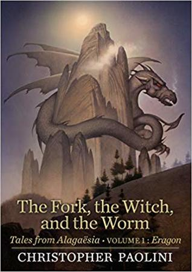

# The Fork, the Witch, and the Worm
By: Christopher Paolini

## Reading Dates
| Start | Finish | Medium |
| ---------- | ---------- | ----- |
| 03/03/2021 | 03/06/2021 | Audio |

---

## Rating and Review ****
I thought these three small stories were a cute glimpse into the fantasy world I've grown to love so much, but there wasn't enough material to be satisfying in any significant way. When the book ended (shortly after it started) I felt myself feeling sad that I had to leave the world of Alagaesia again after so little time following Eragon again after the defeat of Galbatorix. 

I really hope Christopher Paolini goes on to publish more material set in Alagaesia in the future.

---

## Content M.L2.S2.V3

### Recommendability: Maybe
This is something I'd only recommend to someone who is already a fan of the Inheritance cycle. There's not really any reason someone who's not a fan of those books would want to pick this up.

### Language: 2
There may have been a few swear words spread throughout the text, but I think, overall it held closely to the tone and language of the original books in the Inheritance Cycle.

### Sex: 2
There may have been references to dragon reproduction, but there were no other references to or descriptions of sex.

### Violence: 3
There were a few bloody fights spread around the short stories. None of them were described in shocking detail, but they were present.

---
## Spoiler Summary
* The first story is about Murtagh meeting a girl at an inn, discovering some strange rock, fighting off some bad dudes, and giving the innkeeper's daughter an enchanted fork
* The second story contains a couple chapters from Angela's Autobiography which Eragon reads at her request. She travels in some strange portals and rescues Elva from Nesuada in order to train the young girl as her apprentice.
* The third story is an Urgal history recounted to Eragon from some Urgals hanging out with him and the dragons. A female urgal wants to kill a dragon who terrorizes her village. 