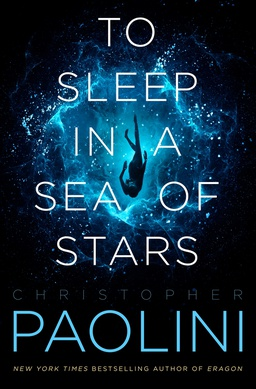

# To Sleep in a Sea of Stars
By: Christopher Paolini

## Reading Dates
| Start | Finish | Medium |
| ---------- | ---------- | ----- |
| 03/09/2021 | 03/15/2021 | Audio |

---

## Rating and Review ****
This was a compelling story in a very well-though-out universe. I'm looking forward to see what future entries Christopher Paolini will make in the Fractalverse.

The "world buidling" for this space opera was very well done. I was very intrigued by the futuristic science presented throughout the story. It diverged from other scifi stories I've read in surprising and entertaining ways. 

As far as criticism goes, I have two minor-ish complaints. At times, the plot was a little jarring as the main cast flipped from one large space-trip-adventure to another. I also (with a couple exceptions) didn't really develop strong attachments to the main cast of characters.

Overall, the story was good and the world-building was great. Even if I didn't develop strong emotional ties to the characters, I find myself surprisingly invested in the universe Christopher Paolini has begun to unravel for us in this book and I look forward to the future entries that he'll write.

---

## Content M.L4.S4.V4
This book hovers very close to the "this book is too inappropriate to finish" line.

### Recommendability: Maybe
This book is a maybe on the recommendability for me. It was an immensely long book (around 900 pages), but it didn't carry the kind of powerful character work or jaw-dropping payoffs works like Brandon Sanderson's or Robert Jordan's similarly-sized volumes do. 

It's a good book and I enjoyed it a lot, but my enjoyment/page number ratio was lower than I would hope for such an investment. Additionally there was strong enough language, sexual content and violence that each area alone made me a little uncomfortable as I read it.

### Language: 4
This book uses a lot of strong language. There are a significant number of action sequences where the "F-word" was repeated multiple times and the book doesn't shy away from any "lower tier" swear words either. 

The book doesn't make casual use of swear words in regular conversation like you might hear in high school hallways, but the characters don't have "clean" mouths by any means.

### Sex: 4
There are a handful of direct references to sex over the course of the book and there is one sex scene. The scene isn't described in any great anatomical detail (just enough to know what is going on), but it definitely happens on-screen and for that, earns the rating of 4 that I've given it.

### Violence: 4
There are some pretty gruesome fights in this story. People get blown apart by bombs, shot with projectile weapons and lasers, there are disgusting cancerous space monsters and lots of blood. The violence in this book could be surprising and disturbing to some people.

---
## Spoiler Summary
* Just read it. 
* I love Gregorovitch